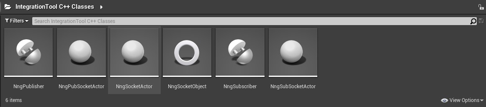
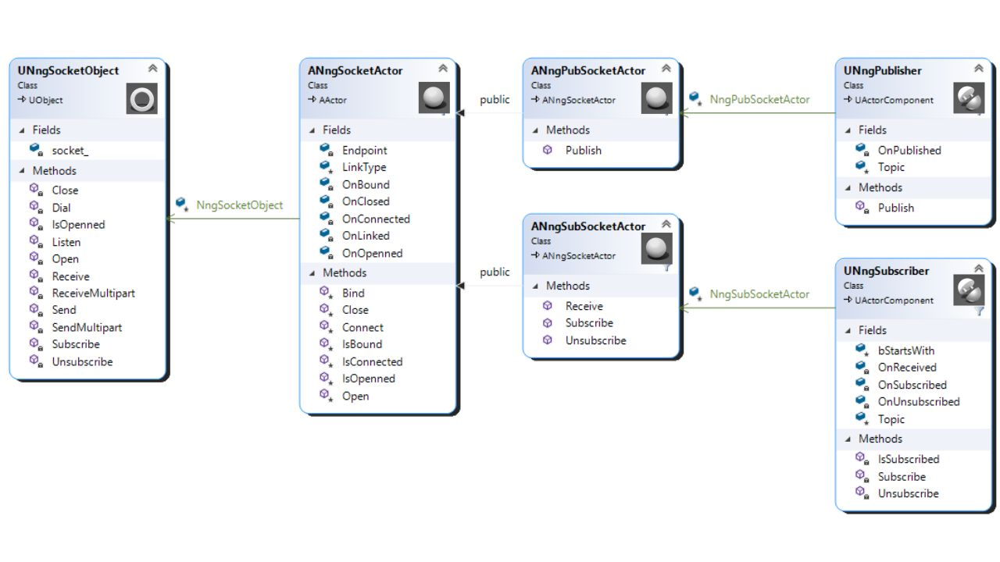
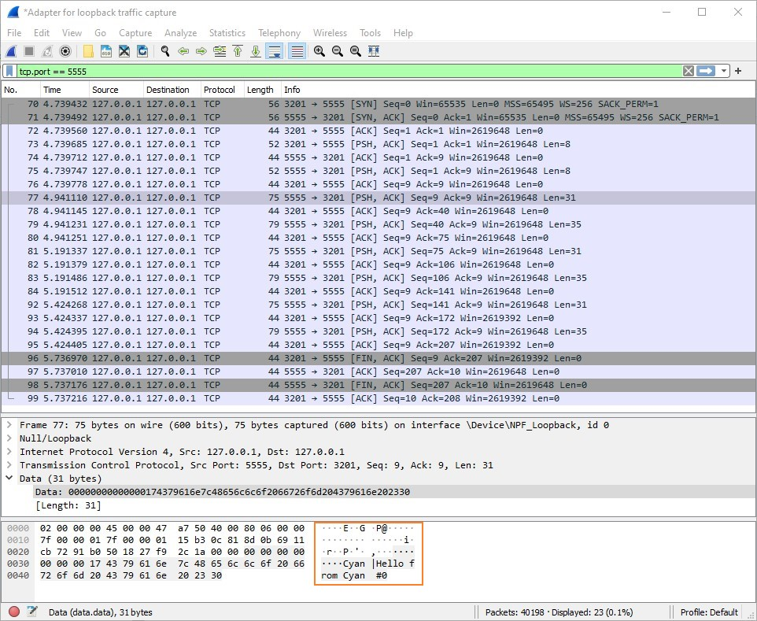

# Unreal Engine Plugin: Integration Tool &ndash; README

Adds Blueprint support for asynchronous messaging with NNG&trade;

Plug-in Version: 1.0.0
<br>Author: [brugr9](https://www.unrealengine.com/marketplace/profile/brugr9)
<br>Copyright 2022 Roland Bruggmann aka brugr9. All Rights Reserved.


## Description

This plug-in enables asynchronous, broker-less messaging using *NNG&trade; next generation of nanomsg&trade;* software from the Blueprint visual scripting system.

The delivered assets provide transporting messages over a network and can be used in games to enable direct machine-to-machine communication, internet of things integration, or interaction with, e.g., an enterprise service bus or an event bus/broker resp. Another use case could be data streaming or instant messaging from a game or into a game.

## Technical Information

Features:

* Demo Map and Blueprints
* Publish-Subscribe aka PUB/SUB Pattern
* Publisher Actor-Component with Blueprint callable function node to publish messages with a specified topic;<br>event on message published
* Subscriber Actor-Component with Blueprint callable function nodes to subscribe or unsubscribe a topic;<br>events on subscribed or on unsubscribed a topic and on received a message
* PUB-Socket and SUB-Socket Actors with Blueprint callable function nodes to
  * Open or close the socket; events on openned or on closed and on errors
  * Bind an endpoint or connect to an endpoint; events on bound or on connected and on errors
* TCP and INPROC
* Custom log category LogNextGenMsg

Code Modules:

* NextGenMsg \[Runtime\]
* NextGenMsgEditor \[Editor\]

Number of Blueprints: 4

Number of C++ Classes: 7

Network Replicated: No

Supported Development Platforms: Windows

Supported Target Build Platforms: Windows (Win64)

Documentation:

* Readme / ThirdParty / Changelog: [https://github.com/brugr9/UEPluginIntegrationTool/](https://github.com/brugr9/UEPluginIntegrationTool/)

Additional Notes:

* Support: [https://github.com/brugr9/UEPluginIntegrationTool/discussions](https://github.com/brugr9/UEPluginIntegrationTool/discussions)

## Tags

Messaging, Integration, M2M, IoT, Network, TCP, INPROC, Socket, PubSub, Runtime

---

<div style='page-break-after: always'></div>

# Documentation

## Table of Contents

<!-- Start Document Outline -->

* [1. Installation](#1-installation)
* [2. Usage](#2-usage)
  * [2.1. Concept](#21-concept)
  * [2.2. Actors](#22-actors)
    * [2.2.1. Abstract Socket Actor](#221-abstract-socket-actor)
    * [2.2.2. PUB-Socket Actor](#222-pub-socket-actor)
    * [2.2.3. SUB-Socket Actor](#223-sub-socket-actor)
  * [2.3. Actor-Components](#23-actor-components)
    * [2.3.1. Publisher Actor-Component](#231-publisher-actor-component)
    * [2.3.2. Subscriber Actor-Component](#232-subscriber-actor-component)
* [3. Demo](#3-demo)

<!-- End Document Outline -->

## 1. Installation

Startup the Unreal Editor, and access the Plugin Editor from the menu 'Edit > Plugins'. In the Plugin Editor, under category 'Messaging' find and enable the plug-in.

Screenshot of Plugin Editor with Plug-in 'Integration Tool':


Finally restart the Unreal Editor. When the plug-in has been loaded successfully, the output log displays a message with the custom log category LogNextGenMsg informing about the library version used:

```log
LogNextGenMsg: Using NNG version 1.5.2
```

<div style='page-break-after: always'></div>

## 2. Usage

### 2.1. Concept

A PUB-socket can be used by multiple publishers to send messages to an endpoint and a SUB-socket can be used by multiple subscribers to receive messages from an endpoint.

Publisher and subscriber actor components are responsible for publishing messages and subscribing to topics and receiving messages. These components contain as a variable a topic to publish or subscribe to. As another variable they contain a reference to a PUB- or SUB-socket instance they work with.

Screenshot of Module NextGenMsg C++ Classes and Class Diagram:





<div style='page-break-after: always'></div>

### 2.2. Actors

PUB-Socket and SUB-Socket Actors may be added to a map by drag'n'drop from 'Place Actors' panel. Please consider: There is no sprite shown in the viewport but the actor is listed in the world outliner.

Screenshot of Actors `NNG PUB-Socket` and `NNG SUB-Socket` listed in Unreal Editor, tab 'Place Actors', category 'All Classes':


<div style='page-break-after: always'></div>

#### 2.2.1. Abstract Socket Actor

A NNG socket can link an endpoint, more precisely it can bind a local address or connect to a remote address. Therefore, `NngSocketActor` has:

* Variables, Endpoint:
  * Transport Type (`Select`): `tcp` (default), `inproc`
  * Host (`String`), default `127.0.0.1`
  * Port (`Integer`), default `5555`
* Functions:
  * `Open`, `IsOpenned`
  * `Bind`, `IsBound` (returns a `Boolean`)
  * `Connect`, `IsConnected` (returns a `Boolean`)
  * `IsLinked` (returns a `Boolean`)
  * `Close`
* Events (Delegates):
  * `OnOpenned`, `OnOpenError` (returns an error message as `String`)
  * `OnBound`, `OnBindError` (returns an error message as `String`)
  * `OnConnected`, `OnConnectError` (returns an error message as `String`)
  * `OnLinked`, `OnLinkError` (returns an error message as `String`)
  * `OnClosed`, `OnCloseError` (returns an error message as `String`)

Upon successful `Open` or `Close`, the `OnOpenned` or `OnClosed` event is triggered. Upon successful `Bind` or `Connect`, the `OnBound` or `OnConnected` event is triggered, as well as event `OnLinked` in both cases. If one the functions `IsBound` or `IsConnected` returns `true`, also the function `IsLinked` returns `true`.

A `NngSocketActor` holds a `NngSocketObject` which acts as a third party library code wrapper where a low level `nng::socket` and its functions are accessed. `NngSocketActor` is an abstract class and is there to be inherited by the messaging pattern specific socket actors that follow now.

<div style='page-break-after: always'></div>

#### 2.2.2. PUB-Socket Actor

A NNG PUB-Socket Actor inherits from abstract class `NngSocketActor`:

* Variables, Endpoint:
  * Transport Type (`Select`): `tcp` (default), `inproc`
  * Host (`String`), default `127.0.0.1`
  * Port (`Integer`), default `5555`
* Functions:
  * `Open`, `IsOpenned`
  * `Bind`, `IsBound` (returns a `Boolean`)
  * `Connect`, `IsConnected` (returns a `Boolean`)
  * `IsLinked` (returns a `Boolean`)
  * `Close`
* Events (Delegates):
  * `OnOpenned`, `OnOpenError` (returns an error message as `String`)
  * `OnBound`, `OnBindError` (returns an error message as `String`)
  * `OnConnected`, `OnConnectError` (returns an error message as `String`)
  * `OnLinked`, `OnLinkError` (returns an error message as `String`)
  * `OnClosed`, `OnCloseError` (returns an error message as `String`)

Upon successful `Open` or `Close`, the `OnOpenned` or `OnClosed` event is triggered. Upon successful `Bind` or `Connect`, the `OnBound` or `OnConnected` event is triggered, as well as event `OnLinked` in both cases. If one the functions `IsBound` or `IsConnected` returns `true`, also the function `IsLinked` returns `true`.

Screenshot of NNG PUB-Socket Actor instance 'Details' panel with variables from Endpoint:


Screenshot of NNG PUB-Socket Actor function and event nodes in a Level Blueprint:


<div style='page-break-after: always'></div>

#### 2.2.3. SUB-Socket Actor

A NNG SUB-Socket Actor inherits from abstract class `NngSocketActor`:

* Variables, Endpoint:
  * Transport Type (`Select`): `tcp` (default), `inproc`
  * Host (`String`), default `127.0.0.1`
  * Port (`Integer`), default `5555`
* Functions:
  * `Open`, `IsOpenned`
  * `Bind`, `IsBound` (returns a `Boolean`)
  * `Connect`, `IsConnected` (returns a `Boolean`)
  * `IsLinked` (returns a `Boolean`)
  * `Close`
* Events (Delegates):
  * `OnOpenned`, `OnOpenError` (returns an error message as `String`)
  * `OnBound`, `OnBindError` (returns an error message as `String`)
  * `OnConnected`, `OnConnectError` (returns an error message as `String`)
  * `OnLinked`, `OnLinkError` (returns an error message as `String`)
  * `OnClosed`, `OnCloseError` (returns an error message as `String`)

Upon successful `Open` or `Close`, the `OnOpenned` or `OnClosed` event is triggered. Upon successful `Bind` or `Connect`, the `OnBound` or `OnConnected` event is triggered, as well as event `OnLinked` in both cases. If one the functions `IsBound` or `IsConnected` returns `true`, also the function `IsLinked` returns `true`. In addition a NNG SUB-Socket Actor has a Blueprint-callable function `Receive` to trigger a message pickup.

Screenshot of NNG SUB-Socket Actor instance 'Details' panel with variables from Endpoint:


Screenshot of NNG SUB-Socket Actor function and event nodes in a Level Blueprint:


<div style='page-break-after: always'></div>

### 2.3. Actor-Components

A NNG Publisher Actor-Component or a NNG Subscriber Actor-Component may be added to a Blueprints 'Components' tab by pressing the 'Add Components' button. The components are listed with category 'Messaging'.

Screenshot of NNG Actor-Components listed in Unreal Editor, tab 'Components', category 'Messaging':


#### 2.3.1. Publisher Actor-Component

A NNG Publisher Actor-Component has:

* Variables:
  * Topic: The topic `String` with which is published
  * PUB-Socket: An `NngPubSocketActor` instance which is used for publishing messages
* Functions:
  * `Publish` with in-parameter 'Message' as `String`
* Events (Delegates):
  * `OnPublished`

Screenshot of NNG Publisher Actor-Component function and event nodes in Event Graph:


<div style='page-break-after: always'></div>

#### 2.3.2. Subscriber Actor-Component

A NNG Subscriber Actor-Component has:

* Variables:
  * Topic: The topic `String` to subscribe to
  * Starts With (Check Box): If checked test whether received topic starts with the given topic &ndash; exact match otherwise (case sensitive string comparison in both cases)
  * SUB-Socket: An `NngSubSocketActor` instance which is used for receiving messages
* Functions:
  * `Subscribe`
  * `IsSubscribed` (returns a `Boolean`)
  * `Unsubscribe`
* Events (Delegates):
  * `OnSubscribed`
  * `OnUnsubscribed`
  * `OnReceived` (returns the received 'Message' as `String`)

Screenshot of NNG Subscriber Actor-Component function and event nodes in Event Graph:


<div style='page-break-after: always'></div>

## 3. Demo

The plug-in folder 'Demo' provides with three Blueprints BP_CubeCyan, BP_CubeYellow and BP_CubeGreen as well as with a map Map_PubSub_Demo.

Screenshot of Content Browser with 'Integration Tool' Content, Folder 'Demo':


The demo implements a PubSub-scheme as follows:

* Two Publisher Actor-Components publish via a PUB-Socket Actor instance
* The PUB-Socket Actor instance binds to tcp://127.0.0.1:5555
* A SUB-Socket Actor instance connects tcp://127.0.0.1:5555
* Two Subscriber Actor-Components subscribe via the SUB-Socket Actor instance

Demo PubSub-Scheme:


<div style='page-break-after: always'></div>

The cyan and the yellow cube each use a NNG Publisher Actor-Component and loop publishing a message 'Hello from Cyan #1' with topic 'Cyan' or 'Hello from Yellow #1' with topic 'Yellow' respectively.

Screenshot of Blueprint BP_CubeCyan:


Screenshot of Blueprint BP_CubeYellow:


<div style='page-break-after: always'></div>

A third, green cube uses two NNG Subscriber Actor-Components to subscribe to topics 'C' and 'Y'&ndash;both check-boxes 'Starts With' are checked&ndash;and appends the received messages to its `TextRender` Scene-Component and prints the same to the Output Log.

Screenshot of Blueprint BP_CubeGreen:


The Map_PubSub_Demo has an instance each of PUB-Socket Actor and SUB-Socket Actor. The sockets link an endpoint with TCP on host 127.0.0.1 and port 5555 (default values).

Screenshot of Map_PubSub_Demo:


<div style='page-break-after: always'></div>

In the Level Blueprint, with `Event BeginPlay` the PUB-Socket Actor's function `Open` is called. With event `OnOpennd (PUB-Socket)` the PUB-Socket Actor's function `Bind` is called.
With event `OnLinked (PUB-Socket)` the SUB-Socket Actor's function `Open` is called. With event `OnOpennd (SUB-Socket)` the SUB-Socket Actor's function `Connect` is called. With event `OnLinked (SUB-Socket)` a timer based event starts a looped call of the SUB-Socket Actor's function `Receive` every other millisecond.

With `Event EndPlay` the Receive-Timer is cleard and invalidated, and the SUB-Socket Actor's as well as the PUB-Socket Actor's function `Close` is called.

Screenshot of Map_PubSub_Demo Level-Blueprint:


The demo map also has instances each of BP_CubeCyan, BP_CubeYellow, and BP_CubeGreen. In these cube instances, the NNG Publisher and NNG Subscriber Actor-Components were each assigned the `NngPubSocketActor` instance or the `NngSubSocketActor` instance, respectively.

Screenshots of BP_CubeCyan and BP_CubeYellow instances 'Details' panel, NNG Publisher Actor-Component with assigned reference to a `NngPubSocketActor` instance:

 

<div style='page-break-after: always'></div>

Screenshots of BP_CubeGreen instance 'Details' panel, NNG Subscriber Actor-Components with assigned references to a `NngSubSocketActor` instance:

 

With the level Map_PubSub_Demo openned, from the Level Editor, click the Play button to Play-in-Editor PIE:


Output Log of Map_PubSub_Demo starting PIE, with custom log category LogNextGenMsg:

```log
[...]
PIE: New page: PIE session: Map_PubSub_Demo ([...])
[...]
LogNextGenMsg: PubSocketActor1_2: Open socket ...
LogNextGenMsg: NngSocketObject_8: Socket successfully openned.
LogNextGenMsg: PubSocketActor1_2: Open socket done.
LogNextGenMsg: PubSocketActor1_2: Bind to tcp://127.0.0.1:5555 ...
LogNextGenMsg: NngSocketObject_8: Successfully listening to tcp://127.0.0.1:5555
LogNextGenMsg: PubSocketActor1_2: Bind done.
LogNextGenMsg: SubSocketActor1_2: Open socket ...
LogNextGenMsg: NngSocketObject_9: Socket successfully openned.
LogNextGenMsg: SubSocketActor1_2: Open socket done.
LogNextGenMsg: SubSocketActor1_2: Connect tcp://127.0.0.1:5555 ...
LogNextGenMsg: NngSocketObject_9: Successfully dialed tcp://127.0.0.1:5555
LogNextGenMsg: SubSocketActor1_2: Connect done.
LogNextGenMsg: BP_CubeGreen_2.Subscriber_C Subscribe topic C ...
LogNextGenMsg: SubSocketActor1_2 Subscribe topic 'C' ...
LogNextGenMsg: NngSocketObject_9: Topic successfully subscribed.
LogNextGenMsg: BP_CubeGreen_2.Subscriber_Y Subscribe topic Y ...
LogNextGenMsg: SubSocketActor1_2 Subscribe topic 'Y' ...
LogNextGenMsg: NngSocketObject_9: Topic successfully subscribed.
PIE: Server logged in
PIE: Play in editor total start time 0.182 seconds.
LogBlueprintUserMessages: [BP_CubeGreen_2] Hello from Yellow #0
LogBlueprintUserMessages: [BP_CubeGreen_2] Hello from Cyan #0
LogBlueprintUserMessages: [BP_CubeGreen_2] Hello from Yellow #1
LogBlueprintUserMessages: [BP_CubeGreen_2] Hello from Cyan #1
LogBlueprintUserMessages: [BP_CubeGreen_2] Hello from Cyan #2
LogBlueprintUserMessages: [BP_CubeGreen_2] Hello from Yellow #2
LogBlueprintUserMessages: [BP_CubeGreen_2] Hello from Cyan #3
LogBlueprintUserMessages: [BP_CubeGreen_2] Hello from Yellow #3
LogBlueprintUserMessages: [BP_CubeGreen_2] Hello from Yellow #4
LogBlueprintUserMessages: [BP_CubeGreen_2] Hello from Cyan #4
[...]
```

Output Log of Map_PubSub_Demo stopping PIE, with custom log category LogNextGenMsg:

```log
[...]
LogWorld: BeginTearingDown for /NextGenMsg/Demo/Maps/UEDPIE_0_Map_PubSub_Demo
LogNextGenMsg: SubSocketActor1_2: Close socket ...
LogNextGenMsg: NngSocketObject_9: Topic 'C' successfully unsubscribed.
LogNextGenMsg: NngSocketObject_9: Topic 'Y' successfully unsubscribed.
LogNextGenMsg: NngSocketObject_9: Socket successfully closed.
LogNextGenMsg: SubSocketActor1_2: Close socket done.
LogNextGenMsg: PubSocketActor1_2: Close socket ...
LogNextGenMsg: NngSocketObject_8: Socket successfully closed.
LogNextGenMsg: PubSocketActor1_2: Close socket done.
[...]
```

Screenshot of localhost tcp communication over port 5555 in in Wireshark:


