# Unreal&reg; Engine Plugin: Integration Tool

Adds Blueprint Support for Asynchronous Messaging using *NNG&trade; next generation of nanomsg&trade;* Software

This document is part of *Unreal&reg; Engine Plugin: Integration Tool &ndash; Documentation*

* Author: Copyright 2022 Roland Bruggmann aka brugr9
* Profile on UE Marketplace: [https://www.unrealengine.com/marketplace/profile/brugr9](https://www.unrealengine.com/marketplace/profile/brugr9)
* Profile on Epic Developer Community: [https://dev.epicgames.com/community/profile/PQBq/brugr9](https://dev.epicgames.com/community/profile/PQBq/brugr9)

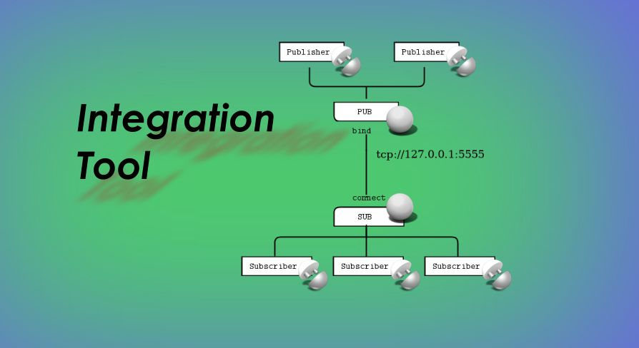

## Description

This plugin enables asynchronous, broker-less messaging using *NNG&trade; next generation of nanomsg&trade;* software from the Blueprint visual scripting system.

The delivered assets provide transporting messages over a network and can be used in games to enable direct machine-to-machine communication, internet of things integration, or interaction with, e.g., an enterprise service bus or an event bus/broker resp. Other use cases could be data streaming or instant messaging from or into a game.

## Technical Information

Features:

* Publish-Subscribe aka PUB/SUB Pattern
* TCP and INPROC
* PUB-Socket Actor and SUB-Socket Actor with Blueprint callable function nodes to
  * Open or close the socket; events on open or on closed and on error
  * Bind an endpoint or connect to an endpoint; events on bound or on connected and on error
* Publisher Actor-Component with Blueprint callable function node to publish messages with a specified topic;<br>event on message published
* Subscriber Actor-Component with Blueprint callable function nodes to subscribe or unsubscribe a topic;<br>event on subscribed or on unsubscribed a topic and on received a message
* Demo Map and Blueprints
* Custom log category LogNextGenMsg

Code Modules:

* NextGenMsg \[Runtime\]
* NextGenMsgEditor \[Editor\]

Number of Blueprints: 4

Number of C++ Classes: 7

Network Replicated: No

Supported Development Platforms: Windows

Supported Target Build Platforms: Windows (Win64)

Documentation:

* Readme, Changelog: [https://github.com/brugr9/UEPluginIntegrationTool/](https://github.com/brugr9/UEPluginIntegrationTool/)

Additional Notes:

* Support: [https://github.com/brugr9/UEPluginIntegrationTool/discussions](https://github.com/brugr9/UEPluginIntegrationTool/discussions)

## Tags

Messaging, Integration, M2M, IoT, Network, TCP, INPROC, Socket, PubSub, Runtime

---

<div style='page-break-after: always'></div>

# Readme

## Table of Contents

<!-- Start Document Outline -->

* [1. Installation](#1-installation)
* [2. Usage](#2-usage)
  * [2.1. Concept](#21-concept)
  * [2.2. Actors](#22-actors)
    * [2.2.1. PUB-Socket Actor](#221-pub-socket-actor)
    * [2.2.2. SUB-Socket Actor](#222-sub-socket-actor)
  * [2.3. Actor-Components](#23-actor-components)
    * [2.3.1. Publisher Actor-Component](#231-publisher-actor-component)
    * [2.3.2. Subscriber Actor-Component](#232-subscriber-actor-component)
* [3. Demo](#3-demo)
* [A. Attribution](#a-attribution)
* [B. References](#b-references)

<!-- End Document Outline -->

## 1. Installation

Startup the Unreal&reg; editor, and from the menu 'Edit > Plugins' access the 'Plugin Editor'. In the 'Plugin Editor', under category 'Messaging' find and enable the plugin.

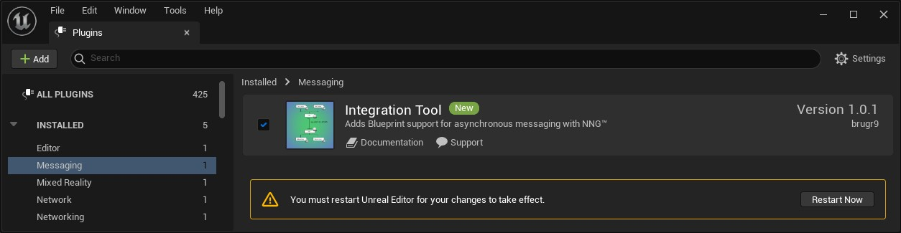
<br>*Fig. 1.: Screenshot of Plugin Editor with Plugin 'Integration Tool'*

Finally restart the editor. When the plugin has been loaded successfully, the output log displays a message with the custom log category LogNextGenMsg informing about the library version used:

```log
LogNextGenMsg: Using NNG version 1.5.2
```

<div style='page-break-after: always'></div>

## 2. Usage

### 2.1. Concept

Publisher and subscriber as actor components are responsible for publishing messages and subscribing to topics and receiving messages. These components contain as a variable a topic to publish or subscribe to. As another variable they contain a reference to a PUB- or SUB-socket instance they work with.

* One or multiple Publisher Actor-Components can access the same PUB-Socket Actor to send messages to the same endpoint (`Publisher : PUB-Socket = n : 1`).
* One or multiple Subscriber Actor-Components can access the same SUB-Socket Actor to subscribe to a topic and to receive messages from the same endpoint (`Subscriber : SUB-Socket = n : 1`).

### 2.2. Actors

The plugin provides with PUB-Sockets and SUB-Sockets which are Actors and may be found in the 'Place Actors' panel, category 'All Classes' and can be added to a map by drag'n'drop. The added actors then are listed in the world outliner. Please consider that in the viewport no sprites are shown for these sockets.

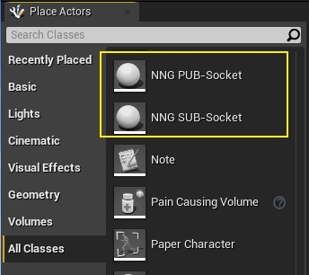
<br>*Fig. 2.3.: Screenshot of Socket Actors listed in Editor Tab 'Place Actors'*

<div style='page-break-after: always'></div>

#### 2.2.1. PUB-Socket Actor

A PUB-Socket Actor has:

* Variables, Group 'Endpoint':
  * Transport Type (`Select`): `tcp` (default), `inproc`
  * Host (`String`), default `127.0.0.1`
  * Port (`Integer`), default `5555`
* Functions:
  * `Open`, `IsOpen`
  * `Bind`, `IsBound` (returns a `Boolean`)
  * `Connect`, `IsConnected` (returns a `Boolean`)
  * `IsLinked` (returns a `Boolean`)
  * `Close`
* Events (Delegates):
  * `OnOpen`, `OnOpenError` (returns an error message as `String`)
  * `OnBound`, `OnBindError` (returns an error message as `String`)
  * `OnConnected`, `OnConnectError` (returns an error message as `String`)
  * `OnLinked`, `OnLinkError` (returns an error message as `String`)
  * `OnClosed`, `OnCloseError` (returns an error message as `String`)

Upon successful `Open` or `Close`, the `OnOpen` or `OnClosed` event is triggered. Upon successful `Bind` or `Connect`, the `OnBound` or `OnConnected` event is triggered, as well as event `OnLinked` in both cases. If one the functions `IsBound` or `IsConnected` returns `true`, also the function `IsLinked` returns `true`.

<div style='page-break-after: always'></div>

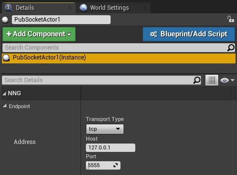
<br>*Fig. 2.4.: Screenshot of PUB-Socket Actor instance 'Details' panel with variables from Endpoint*

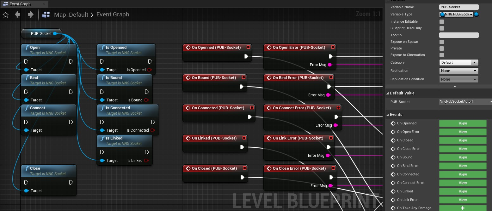
<br>*Fig. 2.5.: Screenshot of PUB-Socket Actor function and event nodes in a Level Blueprint*

<div style='page-break-after: always'></div>

#### 2.2.2. SUB-Socket Actor

A SUB-Socket Actor has:

* Variables, Group 'Endpoint':
  * Transport Type (`Select`): `tcp` (default), `inproc`
  * Host (`String`), default `127.0.0.1`
  * Port (`Integer`), default `5555`
* Functions:
  * `Open`, `IsOpen`
  * `Bind`, `IsBound` (returns a `Boolean`)
  * `Connect`, `IsConnected` (returns a `Boolean`)
  * `IsLinked` (returns a `Boolean`)
  * `Close`
* Events (Delegates):
  * `OnOpen`, `OnOpenError` (returns an error message as `String`)
  * `OnBound`, `OnBindError` (returns an error message as `String`)
  * `OnConnected`, `OnConnectError` (returns an error message as `String`)
  * `OnLinked`, `OnLinkError` (returns an error message as `String`)
  * `OnClosed`, `OnCloseError` (returns an error message as `String`)

Upon successful `Open` or `Close`, the `OnOpen` or `OnClosed` event is triggered. Upon successful `Bind` or `Connect`, the `OnBound` or `OnConnected` event is triggered, as well as event `OnLinked` in both cases. If one the functions `IsBound` or `IsConnected` returns `true`, also the function `IsLinked` returns `true`. In addition a SUB-Socket Actor has a Blueprint-callable function `Receive` to trigger a message pickup.

<div style='page-break-after: always'></div>

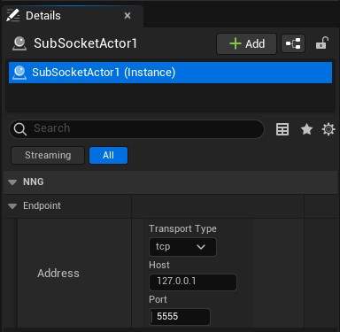
<br>*Fig. 2.6.: Screenshot of SUB-Socket Actor instance 'Details' panel with variables from Endpoint*

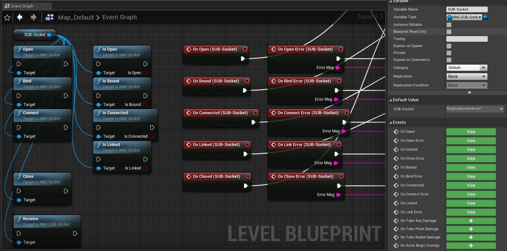
<br>*Fig. 2.7.: Screenshot of SUB-Socket Actor function and event nodes in a Level Blueprint*

<div style='page-break-after: always'></div>

### 2.3. Actor-Components

A Publisher Actor-Component or a Subscriber Actor-Component may be added to a Blueprints 'Components' tab by pressing the 'Add Components' button. The components are listed with category 'Messaging'.


<br>*Fig. 2.8.: Screenshot of Actor-Components listed in tab 'Components', category 'Messaging'*

#### 2.3.1. Publisher Actor-Component

A Publisher Actor-Component has:

* Variables:
  * Topic: The topic `String` with which is published
  * PUB-Socket: A PUB-Socket Actor instance which is used for publishing messages
* Functions:
  * `Publish` with in-parameter 'Message' as `String`
* Events (Delegates):
  * `OnPublished`

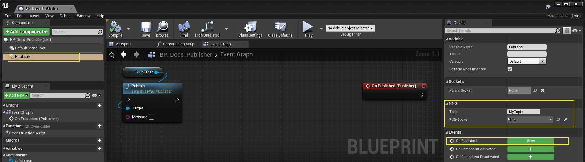
<br>*Fig. 2.9.: Screenshot of an Event Graph with Publisher Actor-Component function and event nodes*

<div style='page-break-after: always'></div>

#### 2.3.2. Subscriber Actor-Component

A Subscriber Actor-Component has:

* Variables:
  * Topic: The topic `String` to subscribe to
  * Starts With (Check Box): If checked test whether received topic starts with the given topic &ndash; exact match otherwise (case sensitive string comparison in both cases)
  * SUB-Socket: A SUB-Socket Actor instance which is used for receiving messages
* Functions:
  * `Subscribe`
  * `IsSubscribed` (returns a `Boolean`)
  * `Unsubscribe`
* Events (Delegates):
  * `OnSubscribed`
  * `OnUnsubscribed`
  * `OnReceived` (returns the received 'Message' as `String`)

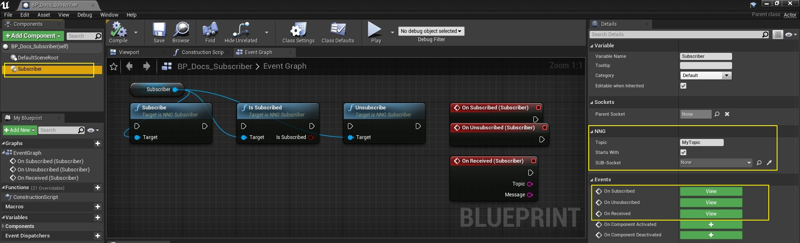
<br>*Fig. 2.10.: Screenshot of an Event Graph with Subscriber Actor-Component function and event nodes*

<div style='page-break-after: always'></div>

## 3. Demo

Find the plugin folders in the editors content browser by checking `View Options > Show Engine Content` and navigate to the folder 'Integration Tool Content'. The folder 'Demo' provides with three Blueprints BP_CubeCyan, BP_CubeYellow and BP_CubeGreen as well as with a map Map_PubSub_Demo.

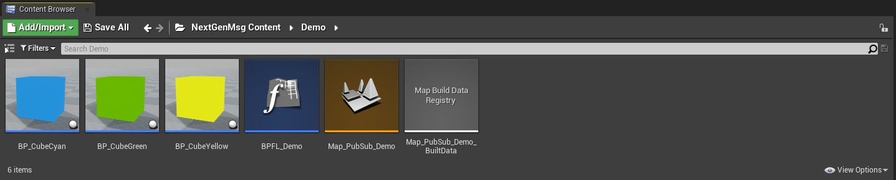
<br>*Fig. 3.1.: Screenshot of Content Browser with 'Integration Tool' Content*

The demo implements a PubSub-scheme as follows:

* A PUB-Socket Actor instance binds address `tcp://127.0.0.1:5555`
* A SUB-Socket Actor instance connects address `tcp://127.0.0.1:5555`
* Two Subscriber Actor-Components subscribe via the SUB-Socket Actor instance
* Two Publisher Actor-Components publish via the PUB-Socket Actor instance

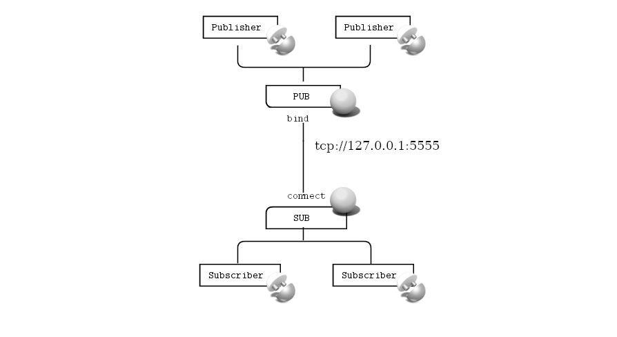
<br>*Fig. 3.2.: Demo PubSub-Scheme*

<div style='page-break-after: always'></div>

The cyan and the yellow cube each use a Publisher Actor-Component and loop publishing a message 'Hello from Cyan' with topic 'Cyan' or 'Hello from Yellow' with topic 'Yellow' respectively.

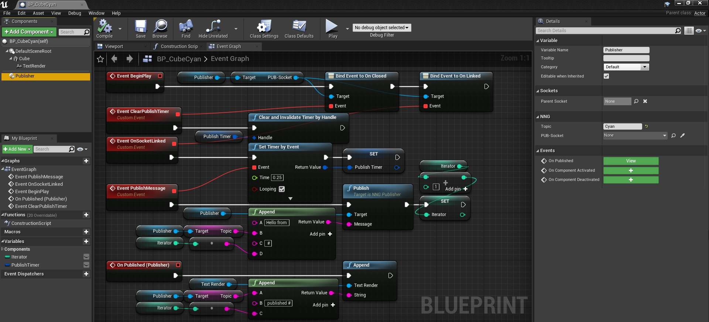
<br>*Fig. 3.3.: Screenshot of Blueprint BP_CubeCyan Event Graph*

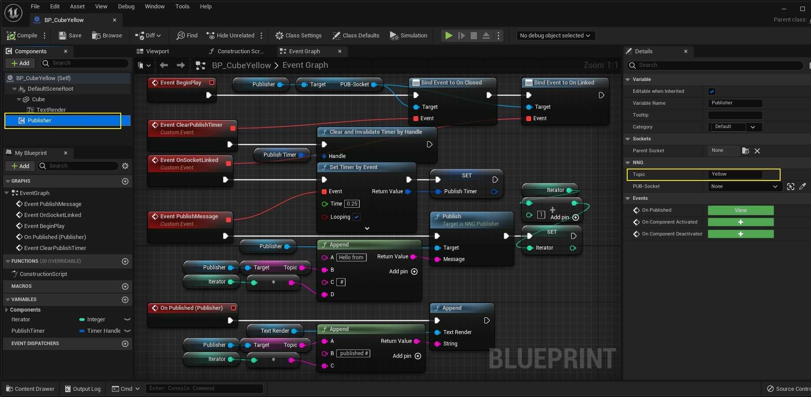
<br>*Fig. 3.4.: Screenshot of Blueprint BP_CubeYellow Event Graph*

<div style='page-break-after: always'></div>

A third, green cube uses two Subscriber Actor-Components to subscribe to topics 'C' and 'Y'&ndash;both check-boxes 'Starts With' are checked&ndash;and appends the received messages to its `TextRender` Scene-Component and prints the same to the Output Log.


<br>*Fig. 3.5.: Screenshot of Blueprint BP_CubeGreen Event Graph*

The Map_PubSub_Demo has an instance each of PUB-Socket Actor and SUB-Socket Actor. The sockets link an endpoint with TCP on host 127.0.0.1 and port 5555 (default values).

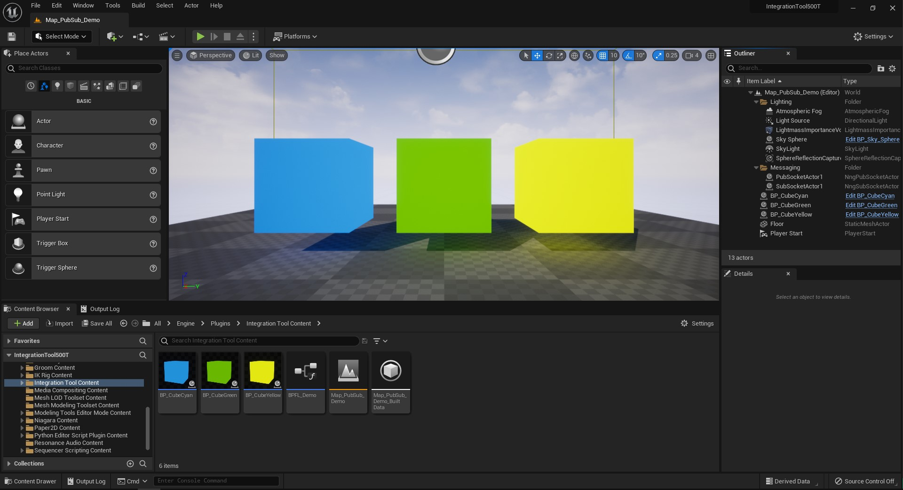
<br>*Fig. 3.6.: Screenshot of Map_PubSub_Demo*

<div style='page-break-after: always'></div>

In the Level Blueprint, with `Event BeginPlay` the PUB-Socket Actor's function `Open` is called. With event `OnOpen (PUB-Socket)` the PUB-Socket Actor's function `Bind` is called.
With event `OnLinked (PUB-Socket)` the SUB-Socket Actor's function `Open` is called. With event `OnOpen (SUB-Socket)` the SUB-Socket Actor's function `Connect` is called. With event `OnLinked (SUB-Socket)` a timer based event starts a looped call of the SUB-Socket Actor's function `Receive` every other centisecond.

With `Event EndPlay` the Receive-Timer is cleard and invalidated, and the SUB-Socket Actor's as well as the PUB-Socket Actor's function `Close` is called.

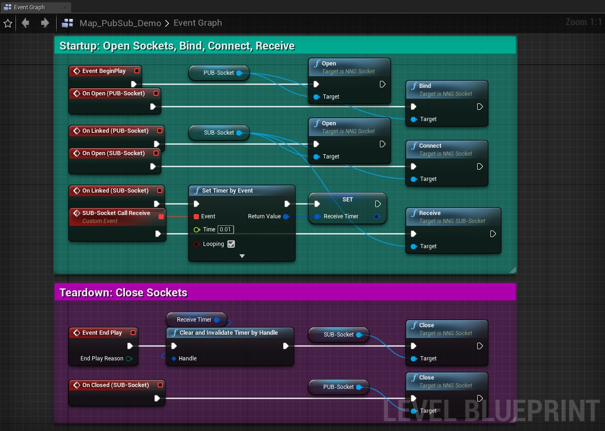
<br>*Fig. 3.7.: Screenshot of Map_PubSub_Demo Level-Blueprint*

<div style='page-break-after: always'></div>

The demo map also has instances each of BP_CubeCyan, BP_CubeYellow, and BP_CubeGreen. In these cube instances, the Publisher and Subscriber Actor-Components were each assigned the  PUB-Socket Actor instance or the  SUB-Socket Actor instance, respectively.

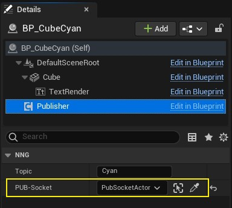
<br>*Fig. 3.8.: Screenshot of BP_CubeCyan instances 'Details' panel, Publisher Actor-Component with assigned reference to a  PUB-Socket Actor instance*

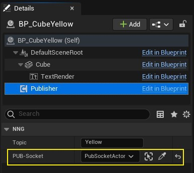
<br>*Fig. 3.9.: Screenshot of BP_CubeYellow instances 'Details' panel, Publisher Actor-Component with assigned reference to a  PUB-Socket Actor instance*

<div style='page-break-after: always'></div>

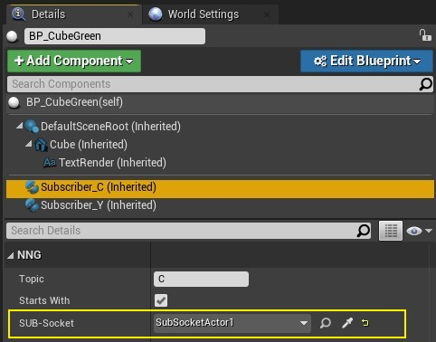
<br>*Fig. 3.10.: Screenshot of BP_CubeGreen instance 'Details' panel, Subscriber Actor-Component 'Subscriber_C' with assigned reference to a  SUB-Socket Actor instance*

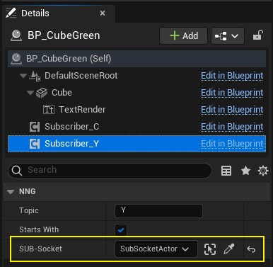
<br>*Fig. 3.11.: Screenshot of BP_CubeGreen instance 'Details' panel, Subscriber Actor-Component 'Subscriber_Y' with assigned reference to a  SUB-Socket Actor instance*

<div style='page-break-after: always'></div>

When the Map_PubSub_Demo level is open, click the Play button in the level editor to start Play-in-Editor PIE.


<br>*Fig. 3.12.: Animation Screenshot of Demo Map PIE*

The plugin writes to the output log with the custom log category LogNextGenMsg.

*Listing 3.1.: Output Log of Map_PubSub_Demo starting PIE*
```log
[...]
PIE: New page: PIE session: Map_PubSub_Demo ([...])
[...]
LogNextGenMsg: PubSocketActor1_2: Open socket ...
LogNextGenMsg: NngSocketObject_8: Socket successfully opened.
LogNextGenMsg: PubSocketActor1_2: Open socket done.
LogNextGenMsg: PubSocketActor1_2: Bind to tcp://127.0.0.1:5555 ...
LogNextGenMsg: NngSocketObject_8: Successfully listening to tcp://127.0.0.1:5555
LogNextGenMsg: PubSocketActor1_2: Bind done.
LogNextGenMsg: SubSocketActor1_2: Open socket ...
LogNextGenMsg: NngSocketObject_9: Socket successfully opened.
LogNextGenMsg: SubSocketActor1_2: Open socket done.
LogNextGenMsg: SubSocketActor1_2: Connect tcp://127.0.0.1:5555 ...
LogNextGenMsg: NngSocketObject_9: Successfully dialed tcp://127.0.0.1:5555
LogNextGenMsg: SubSocketActor1_2: Connect done.
LogNextGenMsg: BP_CubeGreen_2.Subscriber_C Subscribe topic C ...
LogNextGenMsg: SubSocketActor1_2 Subscribe topic 'C' ...
LogNextGenMsg: NngSocketObject_9: Topic successfully subscribed.
LogNextGenMsg: BP_CubeGreen_2.Subscriber_Y Subscribe topic Y ...
LogNextGenMsg: SubSocketActor1_2 Subscribe topic 'Y' ...
LogNextGenMsg: NngSocketObject_9: Topic successfully subscribed.
PIE: Server logged in
PIE: Play in editor total start time 0.182 seconds.
LogBlueprintUserMessages: [BP_CubeGreen_2] Hello from Yellow #0
LogBlueprintUserMessages: [BP_CubeGreen_2] Hello from Cyan #0
LogBlueprintUserMessages: [BP_CubeGreen_2] Hello from Yellow #1
LogBlueprintUserMessages: [BP_CubeGreen_2] Hello from Cyan #1
LogBlueprintUserMessages: [BP_CubeGreen_2] Hello from Cyan #2
LogBlueprintUserMessages: [BP_CubeGreen_2] Hello from Yellow #2
[...]
```

*Listing 3.2.: Output Log of Map_PubSub_Demo stopping PIE*
```log
[...]
LogWorld: BeginTearingDown for /IntegrationTool/Demo/Maps/UEDPIE_0_Map_PubSub_Demo
LogNextGenMsg: SubSocketActor1_2: Close socket ...
LogNextGenMsg: NngSocketObject_9: Topic 'C' successfully unsubscribed.
LogNextGenMsg: NngSocketObject_9: Topic 'Y' successfully unsubscribed.
LogNextGenMsg: NngSocketObject_9: Socket successfully closed.
LogNextGenMsg: SubSocketActor1_2: Close socket done.
LogNextGenMsg: PubSocketActor1_2: Close socket ...
LogNextGenMsg: NngSocketObject_8: Socket successfully closed.
LogNextGenMsg: PubSocketActor1_2: Close socket done.
[...]
```

## A. Attribution

* The word mark *Unreal&reg;* and its logo are Epic Games, Inc. trademarks or registered trademarks in the US and elsewhere (cp. Branding Guidelines and Trademark Usage, URL: [https://www.unrealengine.com/en-US/branding](https://www.unrealengine.com/en-US/branding))
* The word marks *nanomsg&trade;* and *NNG&trade;* and its logos are trademarks of Garrett D'Amore, used with permission (cp. Trademark Policy, URL: [https://nanomsg.org/trademarks.html](https://nanomsg.org/trademarks.html))

## B. References

* *Unreal&reg; Engine Plugin: Integration Tool* by Roland Bruggmann aka brugr9 on Unreal&reg; Marketplace: [https://www.unrealengine.com/marketplace/en-US/product/integration-tool](https://www.unrealengine.com/marketplace/en-US/product/integration-tool)

---

[](https://creativecommons.org/licenses/by-sa/4.0/)

[*Unreal&reg; Engine Plugin: Integration Tool &ndash; Documentation*](https://github.com/brugr9/UEPluginIntegrationTool/) &copy; 2022 by [Roland Bruggmann aka brugr9](https://dev.epicgames.com/community/profile/PQBq/brugr9) is licensed under [Creative Commons Attribution-ShareAlike 4.0 International](http://creativecommons.org/licenses/by-sa/4.0/)
